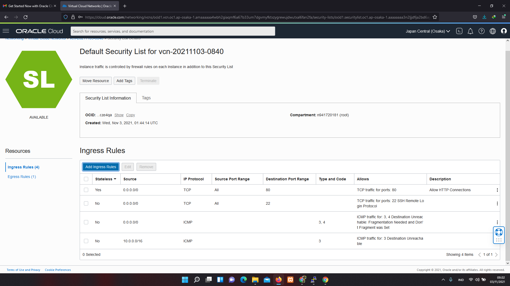

# 03 - Membuat Virtual Machine

## Tujuan Pembelajaran

1. Mengetahui layanan Oracle Cloud Infrastructure Networking
2. Mampu mengaktifkan port 80 melalui Virtual Cloud Network (VCN) di layanan
Oracle Cloud
3. Mampu memasang Apache server dan mengonfigurasi IP tables Firewalls

## Hasil Praktikum

Berikut ini adalah bukti telah berhasil pratikum.

## PRAKTIKUM
I. mengaktifkan Port 80 melalui VCN di Oracle Cloud
1. 

2. 

3. 

4. 

II. Setup Apache di VM
