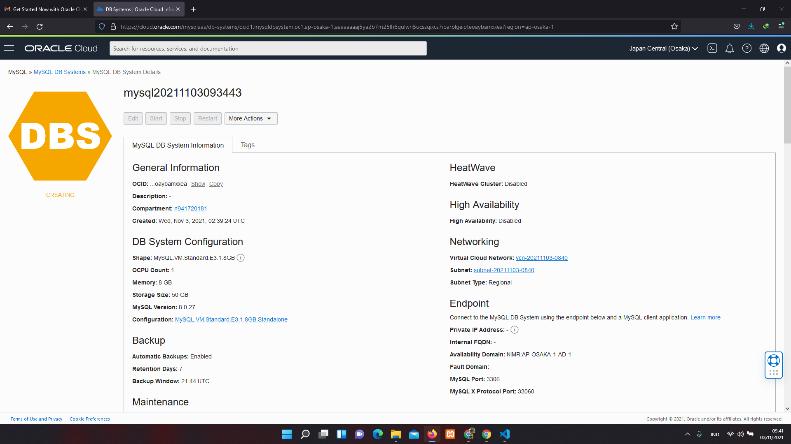
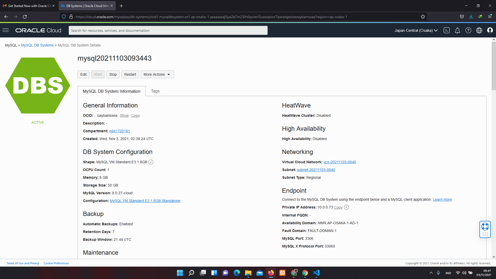
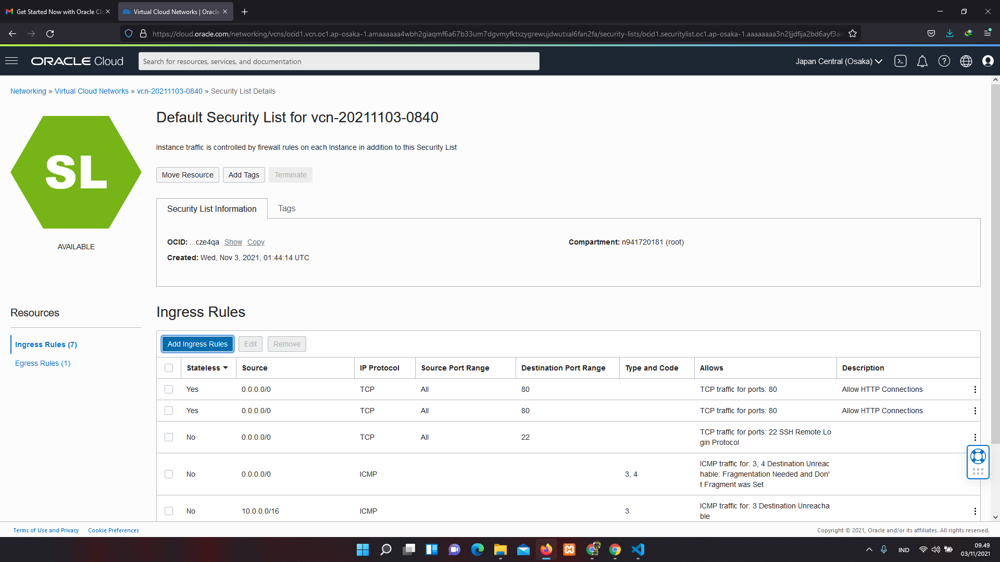
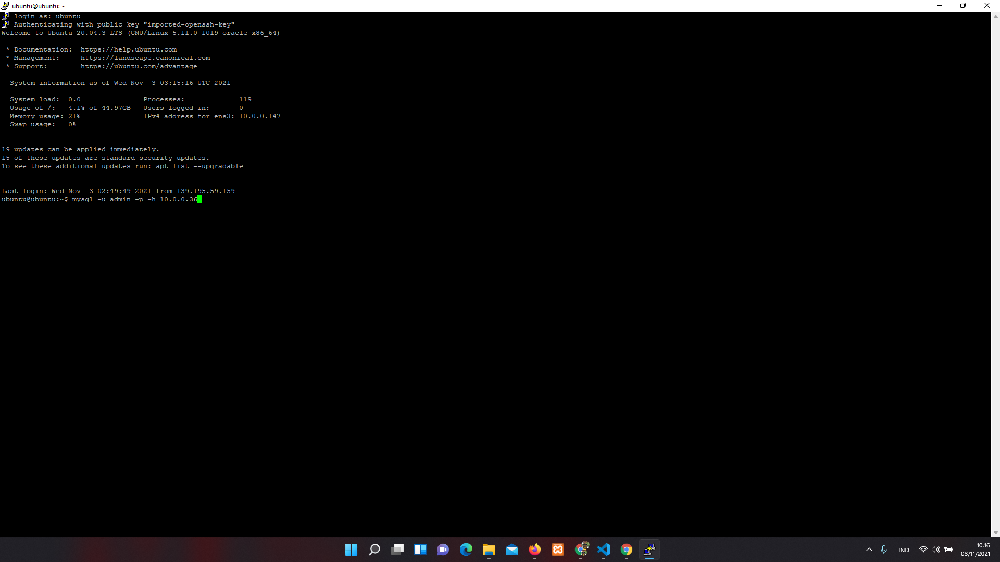

# 05 - PLATFORM AS A SERVICE (PAAS)

## Tujuan Pembelajaran

1. Mengetahui layanan PaaS yang ditawarkan Oracle Cloud Infrastructure (OCI)

2. Dapat memanfaatkan layanan PaaS yang ditawarkan Oracle Cloud Infrastructure (OCI)

## Hasil Praktikum

Berikut ini adalah bukti telah berhasil pratikum.

## PRAKTIKUM
I. Membuat Databases
1. 

2. 

II. Mengkonfigurasi Virtual Cloud Networks (VCN)

1. 

III. Mengakses MySQL dari Melalui SSH

1. 