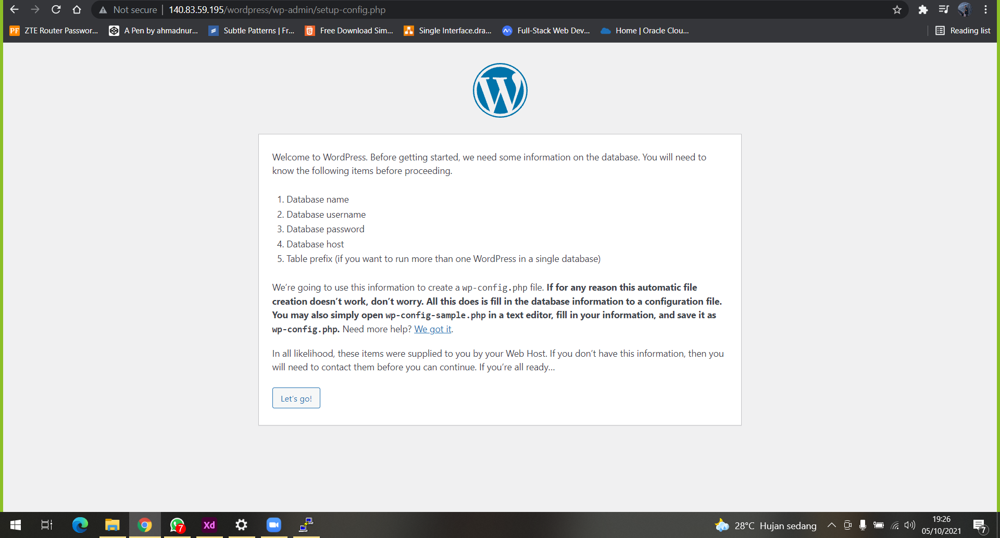
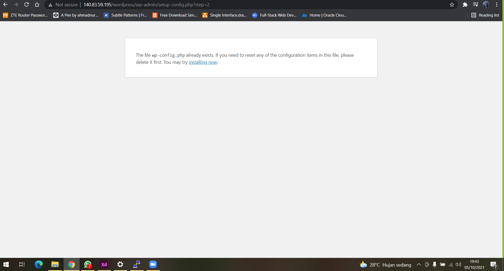
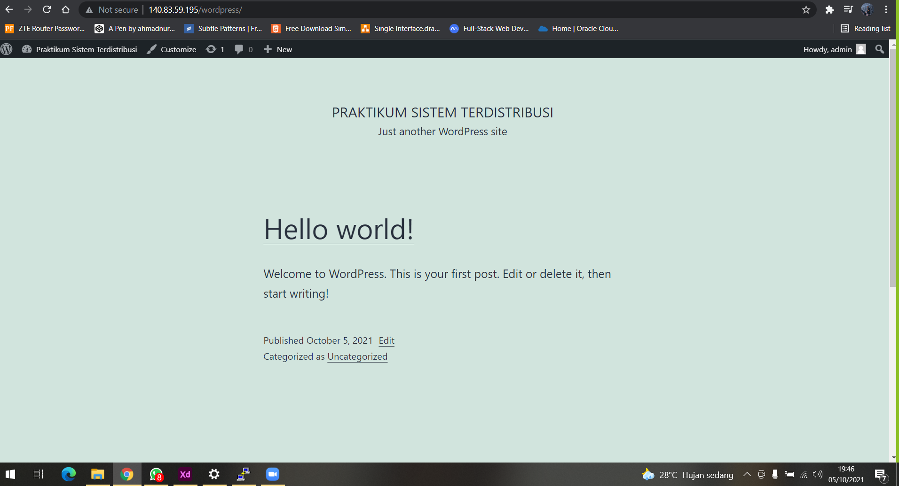

# 05 - Setup PaaS

## Tujuan Pembelajaran

1. Mengetahui layanan yang ditawarkan cloud computing khususnya Oracle Cloud
Infrastructure (OCI)

## Hasil Praktikum

Berikut ini adalah bukti langkah-langkah Praktikum 1

## Praktikum 1

Mengaktifkan Port 80 melalui VCN di Oracle Cloud

## Praktikum 2 Setup Apache di VM

Langkah 1: Lakukan akses ke VM atau server kita dengan perintah berikut in

Langkah 3: Tampilan setelah berhasil login ke VM melalui Putty

## Langkah 4

Setelah terkoneksi dengan VM Anda, silakan lakukan perintah berikut baris
demi baris untuk menginstall Apache server.

## Langkah 5

Setelah terkoneksi dengan VM Anda, silakan lakukan perintah berikut baris
demi baris untuk menginstall Apache server.

## Langkah 5

Setelah terkoneksi dengan VM Anda, silakan lakukan perintah berikut baris
demi baris untuk menginstall Apache server.
