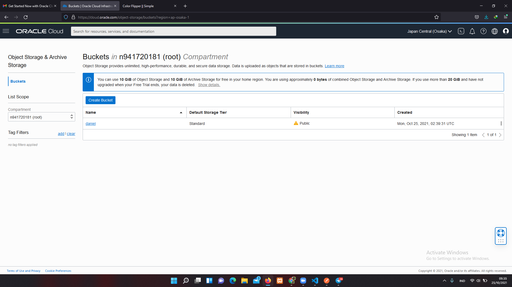
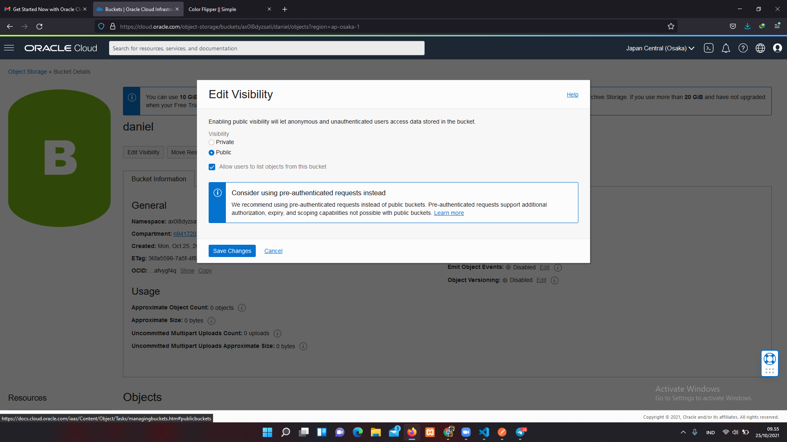
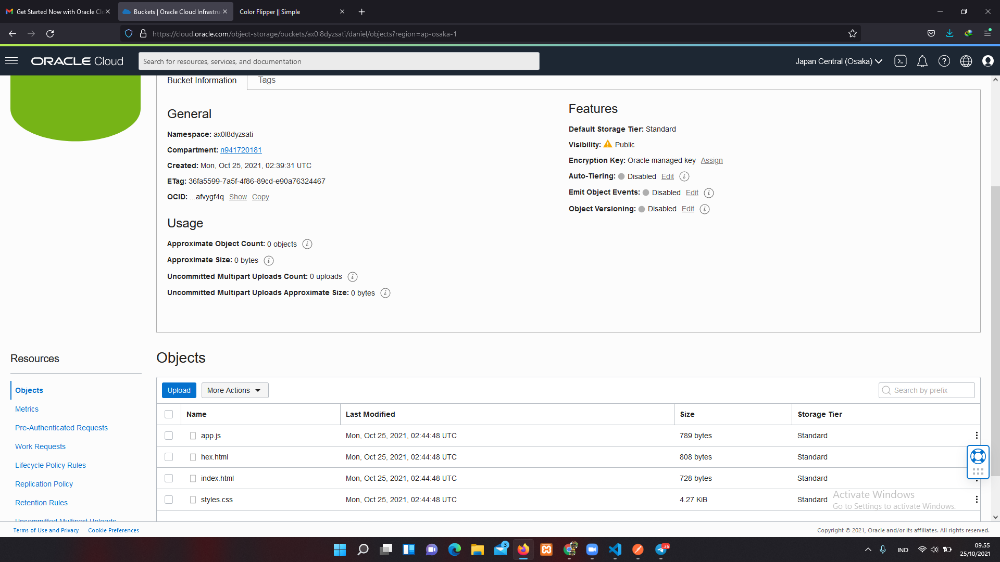
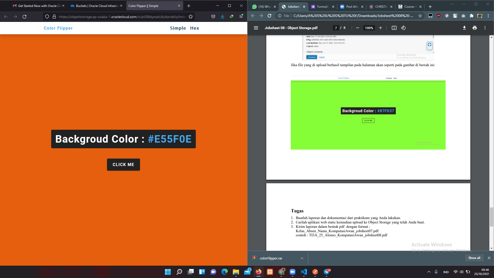
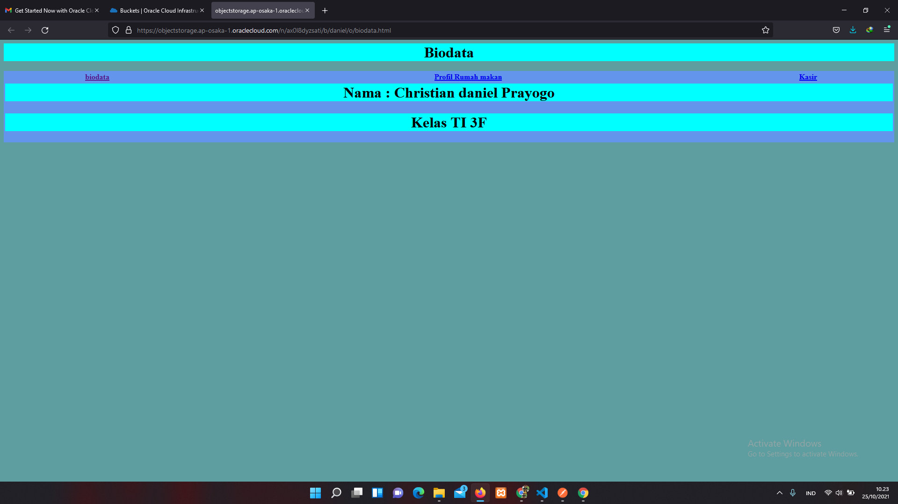

# 03 - Membuat Virtual Machine

## Tujuan Pembelajaran

1. Mengetahui Object Storage yang ditawarkan Oracle Cloud Infrastructure (OCI)
2. Dapat memanfaatkan layanan Object Storage yang ditawarkan Oracle Cloud Infrastructure (OCI)

## Hasil Praktikum

Berikut ini adalah bukti telah berhasil pratikum.

## PRAKTIKUM
1. membuat bucket

2. Mengubah visibility

3. Uploading web page

4. File yang berhasil di upload

# TUGAS

1.Contoh web statis
