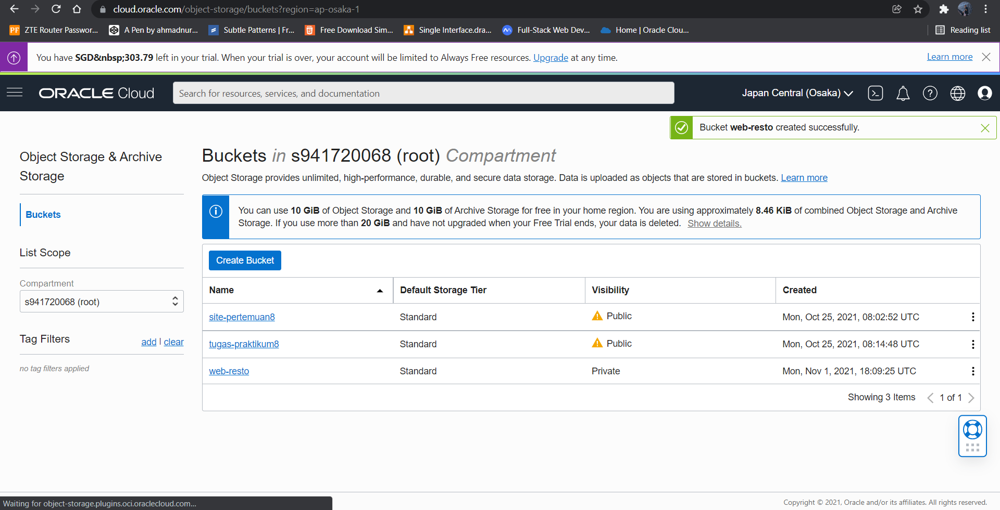
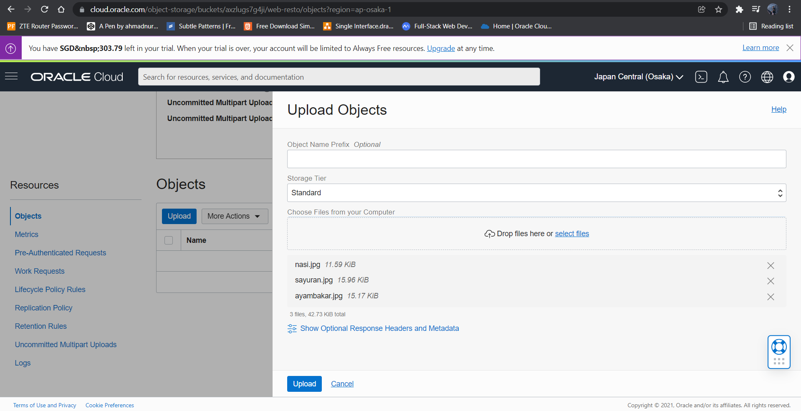

# 01 - Setup Account

## Tujuan Pembelajaran

UTS

## Hasil Praktikum UTS
Langkah Langkah 

Akses VM dengan PuttY 

Cara untuk membuat database pada mysql adalah dengan mengetik perintah di bawah ini.
    1. CREATE DATABASE shoes-store;
    2. SHOW DATABASES;

Sebelum melakukan clone masuk ke mode admin dengan mengetikkan su lalu, Clone Project yang akan dimasukkan ke folder wordpress

Import SQL dari Resto Makan

  

 Isi dari database Resto Makanan

  

Buka file dbconection.php ubah db_name, host, user, dan password.

  

Tampilan Website

  

 Tampilan Dashboard Website Pelanggan

  

Tampilan Order menu

  
 
 Membuat Bukcet di Object Storage

 

  Upload Gambar di Object Storage

 

  Buka file website kita tadi, cari kode yang menampilkan gambar.

 

 Maka gambar kan sesuai dengan gambar yang telah kita upload di storage. 

 
