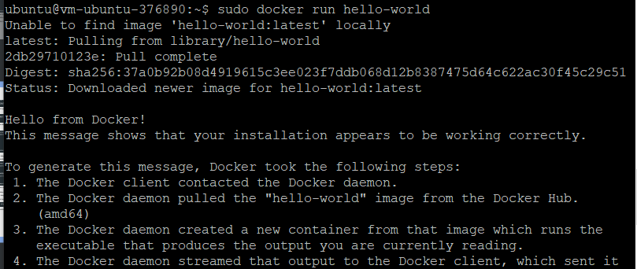
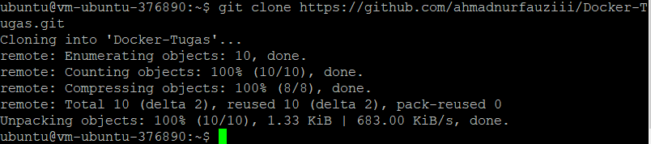

# 10 - Setup Docker

## Hasil Praktikum

Berikut ini adalah praktikum materi Docker 

1. Silakan masuk ke virtual mesin Anda kemudian jalankan perintah di bawah ini

2. Install paket yang dibutuhkan sebelum melakukan installasi docker, jalankan perintah
di bawah ini

3. Langkah selanjutnya yaitu menambahkan repository docker, dengan beberapa baris
perintah di bawah ini

4. Silakan lakukan installasi menggunakan perintah berikut ini

5. Jika menampilkan status active (running), berarti docker daemon sudah berjalan. Untuk
lebih jelasnya perhatikan output di bawah ini

6. Untuk memastikan kembali, kita butuh menggunakan image test apakah docker benarbenar berjalan sebagaimana semestinya. Gunakan perintah di bawah ini

7. Jalankan
perintah docker tanpa menggunakan sudo seperti berikut

8. Ketika kita mengembangkan aplikasi web tentunya membutuhkan sebuah web server, hal yang
sering dilakukan dengan melakukan installasi paket tersebut diikuti dengan Langkah-langkah
yang lain. Dengan docker, kita cukup satu baris perintah apache sudah bisa berjalan. Berikut
ini perintahnya

9. Perintah di atas digunakan untuk membuat container dengan nama contoh-apache dengan
mengexpose port 8080 dari port defaultnya 80, sedangkan image yang digunakan adalah httpd
yang merupakan layanan web server apache. Parameter -d digunakan untuk menjalankan
containersecara background. Silakan cek menggunakan telnet seharusnya sudah bisa terhubung
seperti pada gambar berikut

10. Silakan menuju halaman https://hub.docker.com/signup, akan memuat halaman berikut

11. Clone project yang terdapat di https://gitlab.com/0d3ng/cloud-docker-java-sample.git
masuk ke dalam direktori tersebut dan jalankan perintah build seperti berikut

12. Perintah di atas berarti untuk build image dengan tag “0d3ng/docker-sample-java”,
silakan diganti nama Anda masing-masing. Jika sudah jalankan container
menggunakan image yang telah Anda buat menggunakan perintah berikut.

14. Jika sudah jalankan container
menggunakan image yang telah Anda buat menggunakan perintah berikut
Jika berhasil, maka akan menampilkan string “Hello docker. 

15. Jika kita ingin upload ke docker hub kita, silakan login dulu menggunakan perintah di bawah
ini

16. Selanjutnya kita upload image yang telah kita buat menggunakan perintah di bawah ini

17. Silakan cek docker hub Anda

## TUGAS

1. Silakan clone project dari github

2. Masuk ke directory

3. Menjalankan perintah "Docker build -t untuk membuat images

4. Menjalankan perintah "Docker run -t untuk menjalankan project

5. Login ke akun Docker

6. Ketikan perintah docker push, untuk push ke repository docker yang telah dibuat di praktikum tadi

7. Project berhasil di push ke repository Docker

