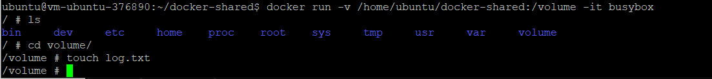

# 11 - Docker2

## Tujuan Pembelajaran

## Hasil Praktikum

## Langkah 1

## Langkah 2

## Langkah 3

## Langkah 4

## Langkah 5

## Langkah 6

## Langkah 7

## Langkah 8

## Langkah 9

## Langkah 10

## Langkah 11

## Langkah 12

## Langkah 13

## Langkah 14

## Langkah 15

## Langkah 16

## Langkah 17

## Langkah 18

## Langkah 19

## Langkah 20

## Langkah 21

## Langkah 22

## Langkah 23

## Langkah 24

## Langkah 25

