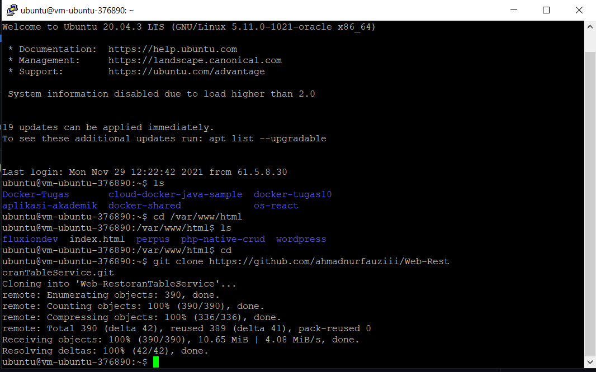
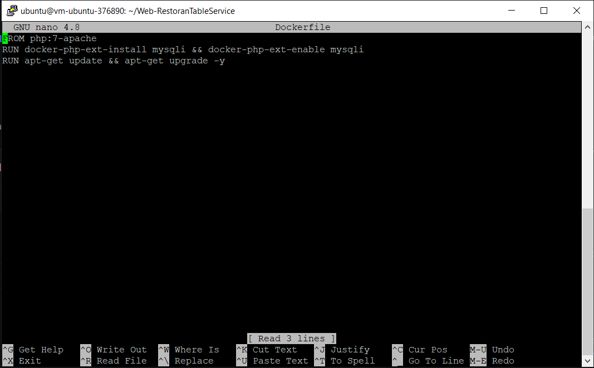
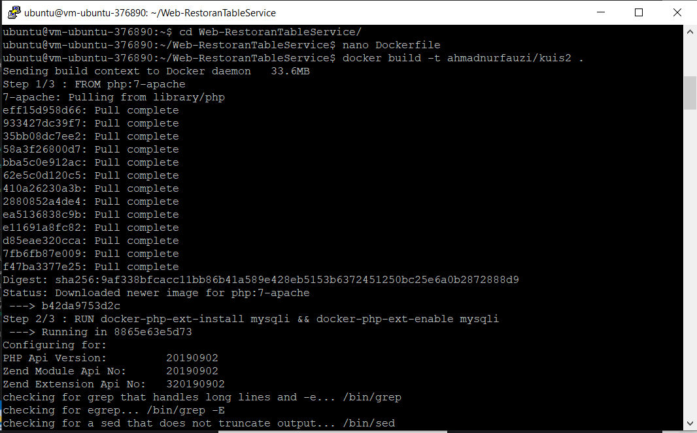
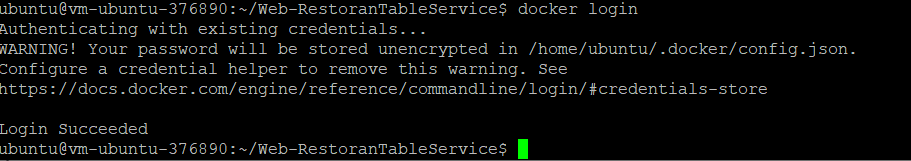
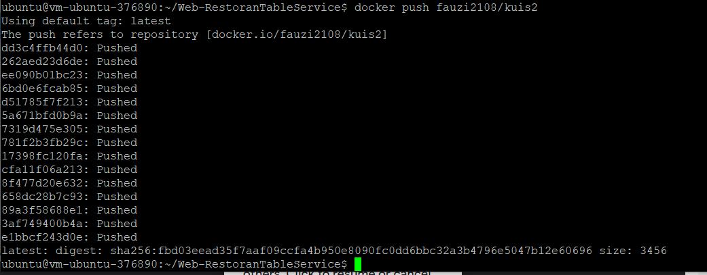

# Kuis 2

## Tujuan Pembelajaran

## Hasil Praktikum

## Langkah 1

Clone Project terlebih dahulu

## Langkah 2

Menambahkan Dockerfile

## Langkah 3

Menambahkan Dockerfile

## Langkah 4

Menambahkan Dockerfil

## Langkah 5

Menambahkan Dockerfile

## Langkah 6

Menambahkan Dockerfile

## Langkah 7

Menambahkan Dockerfile

